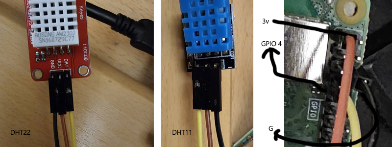

https://www.google.com/search?sca_esv=8ff83a0cf2859f3b&sxsrf=AE3TifMzco6k_vVMF5mVics3b12F69u7gQ:1751339823645&q=車流量大的影片&udm=7&fbs=AIIjpHybaGNnaZw_4TckIDK59RtxnuemxtCAmfx-1cmcosUmu6wlfvA7k4hRg5q_t4x1SurDkB8rh4KwfQdJQNm_4V0zkxDKhWVrn8JwbOAICATuNiHGVKFXi9wvDpC8sLzZ8URU4T-XKukfAcmybsYY4jQWvdYltco2A_KDjwtM0iDF_mjgQthRKxo5s5ctd5jaTdyqqsyn&sa=X&ved=2ahUKEwjn68ag2ZqOAxUokokEHWCiIjcQtKgLKAF6BAgWEAE&biw=1920&bih=945&dpr=1#fpstate=ive&ip=1&vld=cid:d0a356e2,vid:dfnT-k9xq34,st:0  
pip install openai-clip  
  

相關  

資料集  
https://universe.roboflow.com/simulatedbees/bee-hive-vision  
  
ultralytics  
https://docs.ultralytics.com/zh/models/yolo11/  

sqlitebrowser  
https://sqlitebrowser.org/dl/    

ngrok  
https://ngrok.com/  

Visual Studio Code  
https://code.visualstudio.com/  

Bootstrap  
https://getbootstrap.com/  
  
flask  
https://flask.palletsprojects.com/en/stable/  
  
python練習  
https://bdesigner.star-kids.info/  
https://www.w3schools.com/python/default.asp  
https://www.runoob.com/lua/lua-tutorial.html  
  
氣象資料  
https://opendata.cwa.gov.tw/index  

台中市政府資料開放平臺  
https://opendata.taichung.gov.tw/   
https://opendata.taichung.gov.tw/search?sort=view_count_desc   

政府資料開放平台  
https://data.gov.tw  
https://data.gov.tw/dataset/145036  
  
roblox  
https://create.roblox.com/  
https://create.roblox.com/store/asset/948084095/Tag-Editor 
  
------------------------------------------------------------------------------  

-虛擬環境安裝-  
  
*查詢: python --version  
  
*python下載: Note that Python 3.10.10 cannot be used on Windows 7 or earlier.  
Download Windows installer (64-bit)  
  
1->環境變數  
C:\Users\user\AppData\Local\Programs\Python  
C:\Users\XXXX\AppData\Local\Programs\Python\Python310\Scripts\  
C:\Users\XXXX\AppData\Local\Programs\Python\Python310\  
  
2->安裝virtualenv  
pip install virtualenv  
virtualenv 取一個名稱  

指定版本->virtualenv -p python3.12 XXX  
  
3->啟動  
到虛擬環境Scripts目錄中啟動  
activate  

------------------------------------------------------------------------------  

line Developers  
https://developers.line.biz/zh-hant/  
pip install line-bot-sdk  

------------------------------------------------------------------------------  
-pi4 with dht22-  

相關軟體:    
樹莓派軟體:https://www.raspberrypi.com/software/  
putty軟體:https://www.chiark.greenend.org.uk/~sgtatham/putty/latest.html  
vnc軟體:https://www.realvnc.com/en/connect/download/viewer/?lai_sr=0-4&lai_sl=l  
板子:https://images.theengineeringprojects.com/image/webp/2021/03/raspberry-pi-4.png.webp?ssl=1  
  
*指令:  
sudo apt update  
sudo apt upgrade  
sudo raspi-config  
ifconfig  
sudo reboot  

*建立Virtualenv:  
python -m venv myenv  
source myenv/bin/activate  
  
*安裝GPIO  
pip install rpi.gpio  
  
*設定DHT11,DHT22:  
Python Setup  
https://learn.adafruit.com/dht-humidity-sensing-on-raspberry-pi-with-gdocs-logging/python-setup  
Installing the CircuitPython-DHT Library  
https://learn.adafruit.com/circuitpython-on-raspberrypi-linux/installing-circuitpython-on-raspberry-pi  

  

------------------------------------------------------------------------------  

-MQTT Pi4-  
sudo apt-get install mosquitto mosquitto-clients  
sudo systemctl enable mosquitto.service  
sudo nano /etc/mosquitto/mosquitto.conf  
listener 1883  
allow_anonymous true  
sudo reboot  
ifconfig  
pip install 'paho-mqtt<2.0.0'  
pip install rpi.gpio  
git clone https://github.com/miyachun/raspberry-pi4-MQTT  

  

-開通win防火牆1883埠-

設定/隱私權與安全性/Windows安全性/開啟windows安全性/防火牆與網路保護/進階設定/點左方輸入規則/再點右方的新增規則/選擇[連接埠]/下一步/選擇[TCP]/選擇[特定本機連接埠]/輸入1883/下一步/允許連線/下一步接續完成。

-MQTT Window Server-
1->下載 mqtt window server
https://mosquitto.org/download/?source=post_page-----741b655708ff--------------------------------
2->開啟工作管理員/服務/mosquitto(右鍵啟動)，狀態(執行中)
3->修改 config 檔案
位置 : C:\Program Files\mosquitto\mosquitto.conf
加入 :
allow_anonymous true
listener 1883 172.20.10.2 # ip address

在當地目錄下開啟cmd並輸入以下
mosquitto -c mosquitto.conf -v

pip install "paho-mqtt<2.0.0"
  

