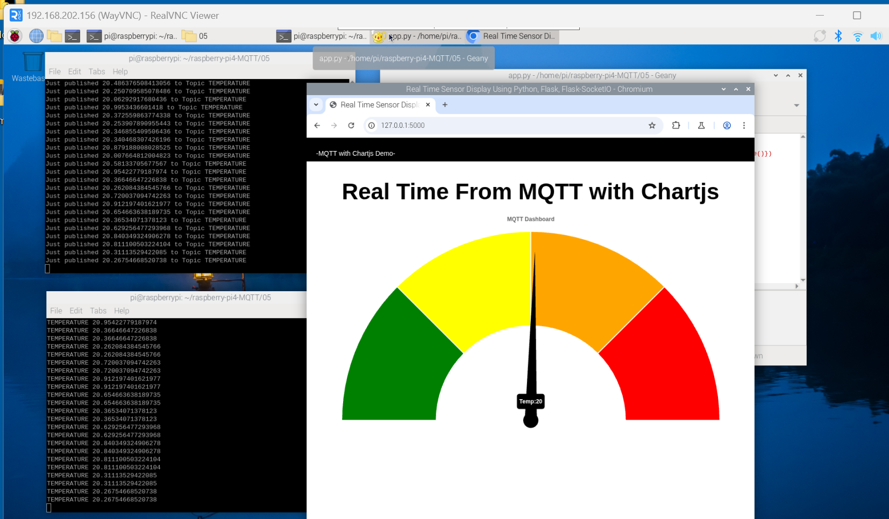

相關  
  
剪刀石頭布(rock-paper-scissors)，資料集->https://universe.roboflow.com/hiraki/rock-paper-scissors-rbzgd/dataset/2  
smeshariks集料集->https://universe.roboflow.com/khalina/smeshariks/dataset/2  

sqlitebrowser  
https://sqlitebrowser.org/dl/    

ngrok  
https://ngrok.com/  

vscode  
https://code.visualstudio.com/  

Bootstrap  
https://getbootstrap.com/  
  
flask  
https://flask.palletsprojects.com/en/stable/  
  
python練習  
https://bdesigner.star-kids.info/  
https://www.w3schools.com/python/default.asp  
https://www.runoob.com/lua/lua-tutorial.html  
  
氣象資料  
https://opendata.cwa.gov.tw/index  

台中市政府資料開放平臺  
https://opendata.taichung.gov.tw/   
https://opendata.taichung.gov.tw/search?sort=view_count_desc   

政府資料開放平台  
https://data.gov.tw  
https://data.gov.tw/dataset/145036  
  
roblox  
https://create.roblox.com/  
https://create.roblox.com/store/asset/948084095/Tag-Editor 
  
------------------------------------------------------------------------------  

-虛擬環境安裝-  
  
*查詢: python --version  
  
*python下載: Note that Python 3.10.10 cannot be used on Windows 7 or earlier.  
Download Windows installer (64-bit)  
  
1->環境變數  
C:\Users\user\AppData\Local\Programs\Python  
C:\Users\XXXX\AppData\Local\Programs\Python\Python310\Scripts\  
C:\Users\XXXX\AppData\Local\Programs\Python\Python310\  
  
2->安裝virtualenv  
pip install virtualenv  
virtualenv 取一個名稱  

指定版本->virtualenv -p python3.10 XXX  
  
3->啟動  
到虛擬環境Scripts目錄中啟動  
activate  

------------------------------------------------------------------------------  
-pi4 with dht22-  

相關軟體:    
樹莓派軟體:https://www.raspberrypi.com/software/  
putty軟體:https://www.chiark.greenend.org.uk/~sgtatham/putty/latest.html  
vnc軟體:https://www.realvnc.com/en/connect/download/viewer/?lai_sr=0-4&lai_sl=l  
板子:https://images.theengineeringprojects.com/image/webp/2021/03/raspberry-pi-4.png.webp?ssl=1  
  
*指令:  
sudo apt update  
sudo apt upgrade  
sudo raspi-config  
ifconfig  
sudo reboot  

*建立Virtualenv:  
python -m venv myenv  
source myenv/bin/activate  
  
*安裝GPIO  
pip install rpi.gpio  
  
*設定DHT11,DHT22:  
Python Setup  
https://learn.adafruit.com/dht-humidity-sensing-on-raspberry-pi-with-gdocs-logging/python-setup  
Installing the CircuitPython-DHT Library  
https://learn.adafruit.com/circuitpython-on-raspberrypi-linux/installing-circuitpython-on-raspberry-pi  

------------------------------------------------------------------------------  

-MQTT Pi4-  
sudo apt-get install mosquitto mosquitto-clients  
sudo systemctl enable mosquitto.service  
sudo nano /etc/mosquitto/mosquitto.conf  
listener 1883  
allow_anonymous true  
sudo reboot  
ifconfig  
pip install 'paho-mqtt<2.0.0'  
pip install rpi.gpio  
git clone https://github.com/miyachun/raspberry-pi4-MQTT  

  

